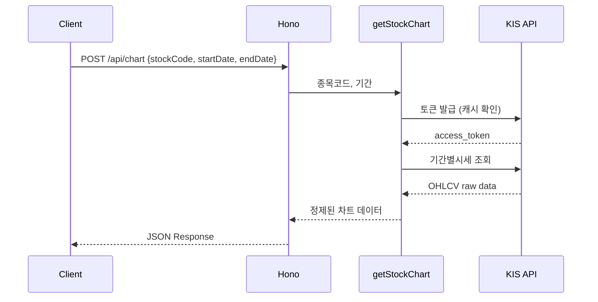
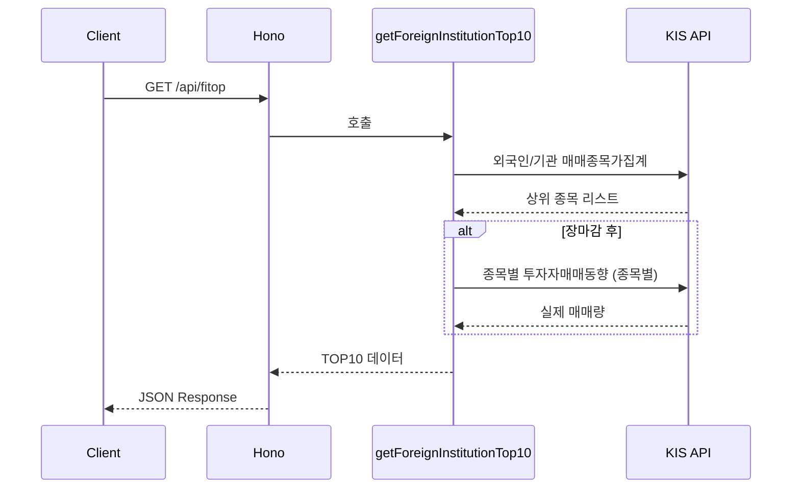

# Daily Stock Spoon - Architecture 문서

## 시스템 아키텍처

```
┌──────────────────────────────────────────────────────┐
│                    Hono Server                        │
│                   (src/index.ts)                      │
│                                                      │
│  POST /api/chart ──── getStockChart()                │
│  GET  /api/fitop ──── getForeignInstitutionTop10()   │
│  POST /api/news  ──── getStockNews()                 │
│  POST /api/news-from-url ── getNewsFromUrl()         │
└──────────────┬───────────────────┬───────────────────┘
               │                   │
        ┌──────┴──────┐     ┌──────┴──────┐
        │  utils/     │     │  utils/     │
        │ 비즈니스     │     │ 크롤링      │
        │ 로직 계층    │     │ 계층        │
        └──────┬──────┘     └──────┬──────┘
               │                   │
     ┌─────────┴─────────┐        │
     │                   │        │
┌────┴────┐       ┌──────┴───┐  ┌─┴───────────┐
│ KIS API │       │Google API│  │ Readability  │
│ Client  │       │ Client   │  │ + JSDOM      │
│(api/kis)│       │(api/ggl) │  │              │
└────┬────┘       └────┬─────┘  └──────────────┘
     │                 │
     ▼                 ▼
┌─────────┐     ┌──────────────┐
│ KIS     │     │ Google CSE   │
│ OpenAPI │     │ REST API     │
└─────────┘     └──────────────┘
```

## 디렉토리 구조

```
daily-stock-spoon/
├── src/
│   ├── api/
│   │   ├── kis/
│   │   │   ├── index.ts         # KIS API 클라이언트 (토큰, 시세, 매매동향)
│   │   │   └── types.ts         # KIS 요청/응답 타입 정의
│   │   └── google/
│   │       ├── index.ts         # Google Custom Search 클라이언트
│   │       └── types.ts         # Google 검색 타입 정의
│   ├── utils/
│   │   ├── getStockChart.ts     # 주식 차트 데이터 조회
│   │   ├── getForeignInstitutionTop10.ts  # 외국인/기관 TOP10
│   │   ├── getStockNews.ts      # 종목 뉴스 조회
│   │   └── getNewsFromUrl.ts    # URL 뉴스 크롤링
│   └── index.ts                 # Hono 서버 엔트리포인트
├── docs/                        # 협업 문서
├── .env                         # 환경변수 (git 제외)
├── .env.example                 # 환경변수 템플릿
├── package.json
├── tsconfig.json
└── README.md
```

## 계층 구조

### 1. API 계층 (`src/api/`)

외부 API와의 통신을 담당. HTTP 요청/응답, 인증, 에러 핸들링을 캡슐화.

| 모듈         | 역할                             | 외부 API    |
| ------------ | -------------------------------- | ----------- |
| `api/kis`    | 한국투자증권 REST API 클라이언트 | KIS OpenAPI |
| `api/google` | Google Custom Search 클라이언트  | Google CSE  |

### 2. 유틸리티 계층 (`src/utils/`)

비즈니스 로직 담당. API 계층을 조합하여 서비스 요구사항 구현.

| 모듈                         | 의존 API                                |
| ---------------------------- | --------------------------------------- |
| `getStockChart`              | KIS (기간별시세)                        |
| `getForeignInstitutionTop10` | KIS (외국인/기관 집계 + 투자자매매동향) |
| `getStockNews`               | Google CSE                              |
| `getNewsFromUrl`             | readability + jsdom                     |

### 3. 서버 계층 (`src/index.ts`)

Hono 기반 HTTP 서버. 라우팅, 입력값 검증, 에러 핸들링.

## 데이터 흐름

### 차트 조회 (`POST /api/chart`)



### 외국인/기관 TOP10 (`GET /api/fitop`)



## 기술 스택

| 분류        | 기술                         | 용도               |
| ----------- | ---------------------------- | ------------------ |
| Runtime     | Node.js                      | 서버 실행 환경     |
| Language    | TypeScript                   | 타입 안전성        |
| Framework   | Hono                         | 경량 웹 프레임워크 |
| HTTP Client | axios                        | API 호출           |
| 뉴스 파싱   | @mozilla/readability + jsdom | HTML→텍스트 변환   |
| 환경변수    | dotenv                       | .env 파일 로드     |
| 테스트      | vitest                       | 단위/통합 테스트   |
